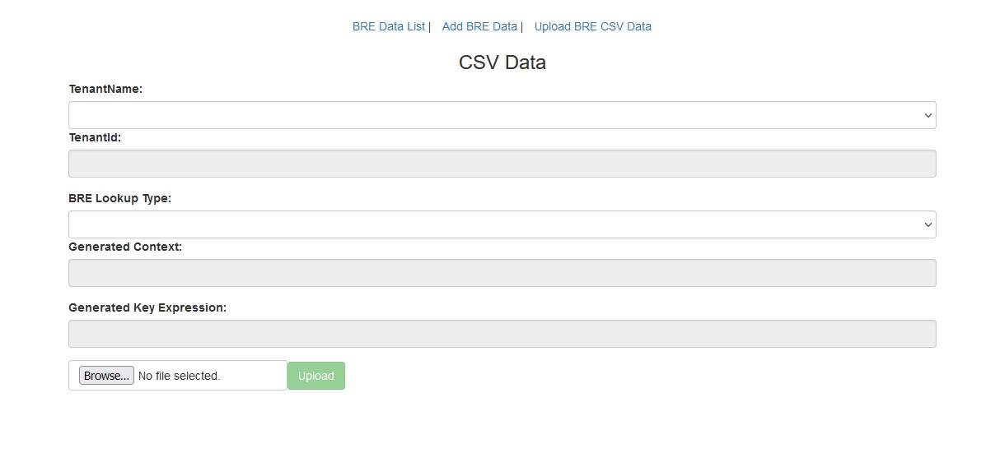

## Fill in the form with the necessary details and click "Update Directions" 
<form>
  
  <label for="dc-rules">Select your data center:</label> 
  <select name="dc-rules" id="dc-rules" onchange="updateRulesLink(value)">
  <option value="Select your data center"></option>
  <option value="https://bre.produs1.ciscoccservice.com/bre/">US1</option>
  <option value="https://bre.prodeu1.ciscoccservice.com/bre/">EU1</option>
  <option value="https://bre.prodeu2.ciscoccservice.com/bre/">EU2</option>
  <option value="https://bre.prodanz1.ciscoccservice.com/bre/">ANZ1</option>
  <option value="https://bre.prodca1.ciscoccservice.com/bre/">CA1</option>
  <option value="https://bre.prodjp1.ciscoccservice.com/bre/">JP1</option>
  <option value="https://bre.prodsg1.ciscoccservice.com/bre/">SG1</option>
  </select> 
  
  <label for="context">Lookup Table Name:</label> 
  <input type="text" id="context" name="context"> 
  
  <label for="label">Label Name (keep default unless you have a reason):</label> 
  <input type="text" id="label" name="label" value="routeInfo"> 
  
  <label for="key">Key to be used in flows:</label> 
  <input type="text" id="key" name="key"> 

  <label for="lookup-var">Value or the variable used to pass the value to be looked up from your flow   (if you are using a variable remember to encapsulate it in double curly braces):</label> 
  <input type="text" id="lookup-var" name="lookup-var"> 

  <label for="data-var">Name of the variable you want the data returned to in your flow:</label> 
  <input type="text" id="data-var" name="data-var"> 
 

  <button onclick="update()">Update Directions</button>
</form>

---

## Preparing the tenant to use the BRE:

 ⚠️ **Important note:** All BRE are settings, rules, attributes, and labels are case sensitive!
 

#### Navigate to the Business Rules 
> If you are a full admin on the Org you can cross launch or navigate directly to: <a id="rules-link" href="" target="_blank">Select your data center</a>
>
> If you are an external admin you must cross launch from the portal.
>
> 
 
How to cross launch to BRE Rules

>
> 
> 

**The steps in this section only need to be completed once on your tenant**
>
>> Click Attributes in the top ribbon 
>>
>> Click Add  
>> 
>>> Name: <copy>context</copy> (case sensitive) 
>>>
>>> Data Type: Text
>>>
>>> Click Save
>>
>> Click Labels in the top ribbon
>>
>>> Click Add 
>>>
>>> Name: <copy><w class="label_out">routeInfo</w></copy> (case sensitive)
>>>
>>> Click Save
>>
---

**The steps in this section need to be completed for all new lookups on your tenant**

> Click Context in the top ribbon
>
>> Click Add Context 
>>>
>>> Name: <copy><w class = "context_out">Table/Context which was created for you</w></copy> (case sensitive) 
>>> 
>>> Attribute: context 
>>>
>>> Click Save
>>
>> Click on the line of the Context you just created (<w class = "context_out"></w>)
>>
>>
>> Add the rules listed below

#### Create the "Found" rule

> Click on Add Rule (Editor)
> 
> Name: <copy><w class="context_out"></w>Found </copy>
> 
> Active: True
> 
> Label: <copy><w class = "label_out">routeInfo</w></copy>
>
> Priority: 100
>
> Copy the rule into the editor:
>
>> <copy><textarea id="foundruleDisplay" style="width: 1100px; height: 100px;" readonly>when
>>    c: Contact()
>>    eval(c.getGlobalValuesManager().getAsString( c.getTenantId(), c.getAttribute("context") + "." + c.getAttribute("ani")) != null)
>> then
>>    c.putAttribute("routeInfo", c.getGlobalValuesManager().getAsString(c.getTenantId(), c.getAttribute("context") + "." + c.getAttribute("ani")));
>> end </textarea></copy> 

<ww id="foundRule" style="display: none" >when 
    c: Contact() 
    eval(c.getGlobalValuesManager().getAsString( c.getTenantId(), c.getAttribute("context") + "." + c.getAttribute("<w class = "key_out">ani</w>")) != null) 
then 
    c.putAttribute("<w class = "label_out">routeInfo</w>", c.getGlobalValuesManager().getAsString(c.getTenantId(), c.getAttribute("context") + "." + c.getAttribute("<w class = "key_out">ani</w>"))); 
end  </ww>

#### Create the "NotFound" rule

> Click on Add Rule (Editor)
> 
> Name: <copy><w class="context_out"></w>Notfound</copy>
> 
> Active: True
> 
> Label: <copy><w class = "label_out">routeInfo</w></copy>
> 
> Priority: 99
>
> Copy the rule into the editor:
>
>
>> <copy><textarea id="notfoundruleDisplay" style="width: 1100px; height: 100px;" readonly>when
>>    c: Contact()
>>    eval(c.getGlobalValuesManager().getAsString( c.getTenantId(), c.getAttribute("context") + "." + c.getAttribute("ani")) == null)
>> then
>>   c.putAttribute("routeInfo", "NotFound");
>> end </textarea></copy> 

---

<ww id="notfoundRule" style="display: none" >
when 
    c: Contact() 
    eval(c.getGlobalValuesManager().getAsString( c.getTenantId(), c.getAttribute("context") + "." + c.getAttribute("<w class = "key_out">ani</w>")) == null) 
 then 
   c.putAttribute("<w class = "label_out">routeInfo</w>", "NotFound"); 
 end 
</ww>

## Adding, updating, and removing data from your BRE table
  <form>
  <label for="dc-data">Select your data center:</label> 
  <select name="dc-data" id="dc-data" onchange="updateDataLink(value)">
  <option value="Select your data center"></option>
  <option value="https://bre-datasync.produs1.ciscoccservice.com/datasync/">US1</option>
  <option value="https://bre-datasync.prodeu1.ciscoccservice.com/datasync/">EU1</option>
  <option value="https://bre-datasync.prodeu2.ciscoccservice.com/datasync/">EU2</option>
  <option value="https://bre-datasync.prodanz1.ciscoccservice.com/datasync/">ANZ1</option>
  <option value="https://bre-datasync.prodca1.ciscoccservice.com/datasync/">CA1</option>
  <option value="https://bre-datasync.prodjp1.ciscoccservice.com/datasync/">JP1</option>
  <option value="https://bre-datasync.prodsg1.ciscoccservice.com/datasync/">SG1</option>
  </select>
</form>

### Logging in
> Navigate to <a id="data-link" href="" target="_blank">Select your data center</a>
<!-- > [https://rules.wxcc-us1.cisco.com/datasync/login](https://rules.wxcc-us1.cisco.com/datasync/login){:target="_blank"} -->
>
> 
 
Click the cluster to login

> 
>
> 

>
> ---
<!-- >
>
>> Login using your tenant admin credentials if prompted
>
> 
 
Select Site A

> 
> -->
<!-- > 
 -->
<!-- >
> --- -->

### Adding and updating data
>
> 
 
Click Add BRE Data

> 
>
> 

>
> Select your tenant name from the Tenant Name drop down
>
> Select the table name you want to add/update data to in the BRE Lookup Type drop down
>
> Add the value you will be looking up in the Key field
>
> Add the value you want to be returned in the Value field
>
> Clicking Add Data will let you add additional rows
>
> Clicking the Remove button will remove the row from your Add/Update 
>
> > ⚠️ Note this will not delete entries from the BRE.  If you need to delete entries, you must use the CSV method in the next section.
>
> Click Submit to save the updates
>
> ---

### Adding, updating, and removing data in bulk

>
> Create a CSV file with 3 columns
>
> > ⚠️ CSV must have headers in the file or the first row will be skipped 
> >
> > Key: the value you will be looking up
> >
> > Value: the value you want to be returned
> >
> > Action: the action you want taken on the key (ADD, UPDATE, DELETE)
> >
> > 
 
Example

> > 
> > 

> >
>
>
> 
 
Click Upload BRE CSV data

> 
>
> 

>
> Select your tenant name from the Tenant Name drop down
>
> Select the table name you want to add/update data to in the BRE Lookup Type drop down
>
> Browse to select your CSV
>
> Click Upload
>
> ---

## Accessing the BRE data from your flow
> 

> 
> <w style="position: absolute; top: 27%; left:53%; color: rgb(0,0,0);" class = "context_out">table</w>
> <w style="position: absolute; top: 41%; left: 8%; color: rgb(0,0,0)" class = "key_out">ani</w>
> <w style="position: absolute; top: 41%; left: 53%; color: rgb(0,0,0)" class="lookup-var_out">your lookup value</w>
> 

>
> ---

## Parsing BRE data to a variable
> 

>
> 
> <w style="position: absolute; top: 65px; left:40px; color: rgb(0,0,0)" class="data-var_out">YourOutputVariable</w>
> <w style="position: absolute; top: 140px; left:40px; color: rgb(0,0,0)">$.<w class = label_out>routeInfo</w></w>
> 

>
> ---

 